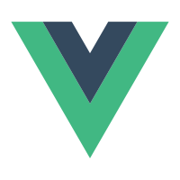
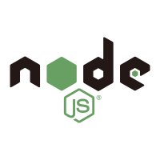
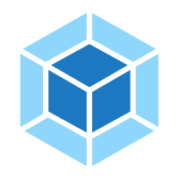
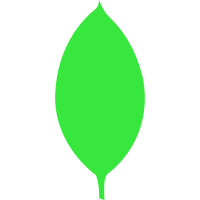

<h1 align="center">Hi 👋, I'm Peigo</h1>
<h3 align="center">A software developer from China</h3>

 

## 📅 Hobbies
- Visit the technical community
- Read some books about js
- Watch anime And Travel Video
- Play videogames
- Listen to music.

 

## 😄 Talking about Personal Stuffs:
- 🌱 I'm currently into Web Development
- 🔭 working on my Data Structures and Algorithms
- 🚀 In the future, I hope to become Full Stack Development.
- ⚡ Interested in Go and Rust

 

## 🔨 Languages and Tools :

 
JavaScript
JavaScript
JavaScript
JavaScript
JavaScript
JavaScript
JavaScript
JavaScript
JavaScript
JavaScript
JavaScript
JavaScript
 

### 📊 Github Stats

 
<!--
**Candane/candane** is a ✨ _special_ ✨ repository because its `README.md` (this file) appears on your GitHub profile.

Here are some ideas to get you started:

- 🔭 I’m currently working on ...
- 🌱 I’m currently learning ...
- 👯 I’m looking to collaborate on ...
- 🤔 I’m looking for help with ...
- 💬 Ask me about ...
- 📫 How to reach me: ...
- 😄 Pronouns: ...
- ⚡ Fun fact: ...
-->
