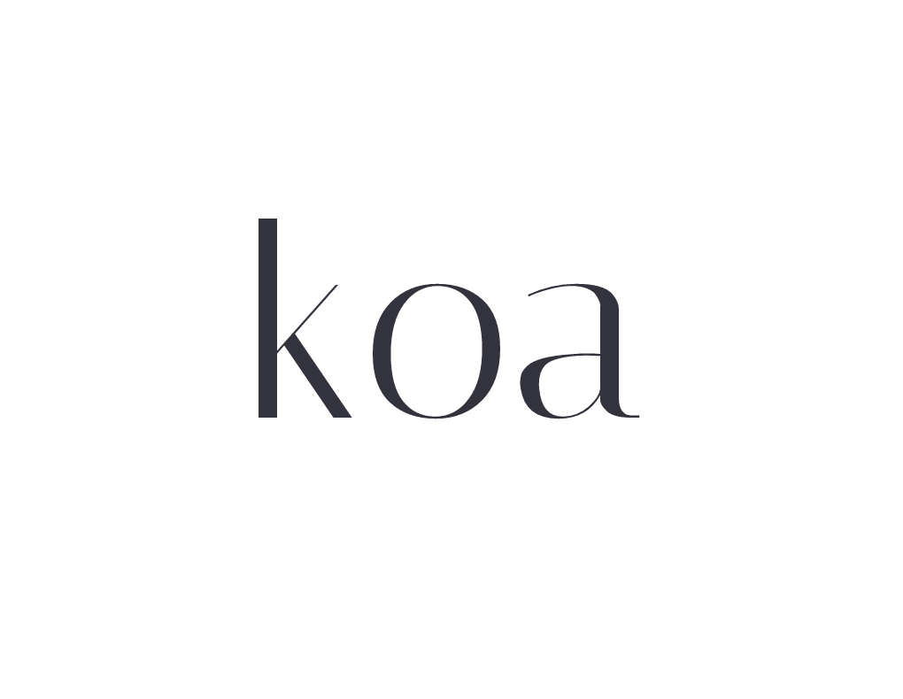

<h1 align="center">Hi 👋, I go by Pejaz, but Jasper works too if that's easier</h1>
<h3 align="center">A software developer from China</h3>
  
  
### 📅 Hobbies

🗣️ Engaging with dev communities (DEV.to & juejin.cn)
📺 Binge-watching anime & tech travel vlogs
🎮 Casual gaming (Currently hooked on Switch)
🎧 Coding with lo-fi beats looping
  
### 👨💻 ​Current Focus

🌱 Full-time web engineer (Next.js + TypeScript)
📖 Exploring Rust's ownership model through practice
🔭 Mastering CS fundamentals: DSA, networks & OS concepts
🚀 Aiming to build robust full-stack systems
  
### 🔨 Languages and Tools

 
 
  
### 📊 Github Stats

  

  
  
<!--
**Candane/candane** is a ✨ _special_ ✨ repository because its `README.md` (this file) appears on your GitHub profile.

Here are some ideas to get you started:

- 🔭 I’m currently working on ...
- 🌱 I’m currently learning ...
- 👯 I’m looking to collaborate on ...
- 🤔 I’m looking for help with ...
- 💬 Ask me about ...
- 📫 How to reach me: ...
- 😄 Pronouns: ...
- ⚡ Fun fact: ...
-->
